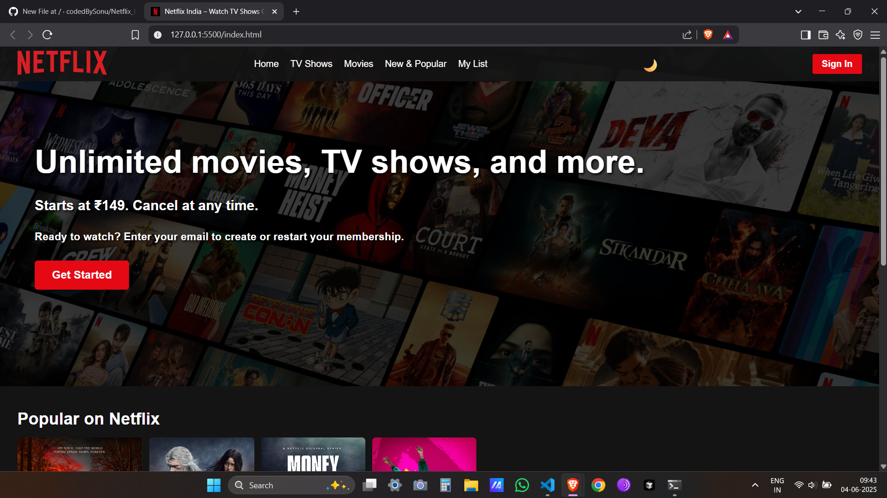
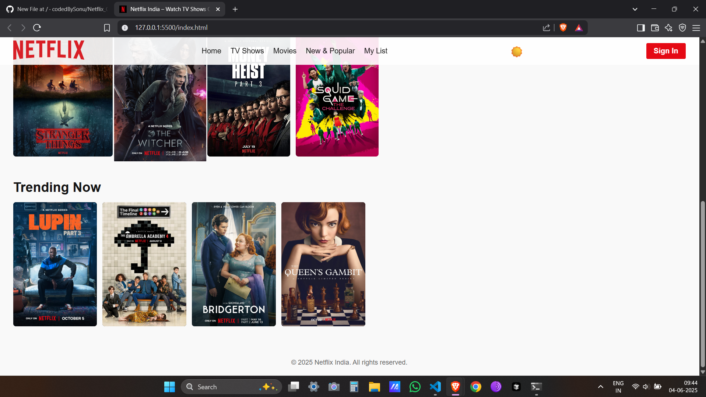

# 🎬 Netflix Clone

A responsive web app that replicates the UI and feel of **Netflix**, built with **HTML**, **CSS**, and **JavaScript**. 🍿

---

## 🔗 Live Project  
[View Now](https://your-live-project-link.com)

---

## 🚀 Features

- Hero banner with call-to-action button  
- Popular shows and movies grid  
- Responsive design for desktop and mobile  
- Light and dark mode toggle (if implemented)  
- Interactive UI elements with JavaScript  

---

## 📸 Screenshot

---

## ⚠️ Disclaimer

This project is built purely for **educational purposes**.  
It is **not affiliated** with or endorsed by Netflix.

---

## 📁 Folder Structure

index.html
style.css
script.js

## 💡 Tech Stack

- HTML  
- CSS  
- JavaScript  

---

## 📬 Contact

If you'd like to collaborate or suggest improvements, feel free to open an issue or pull request.

---

**Created by Sonu Kumar Singh**
